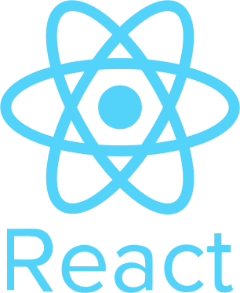
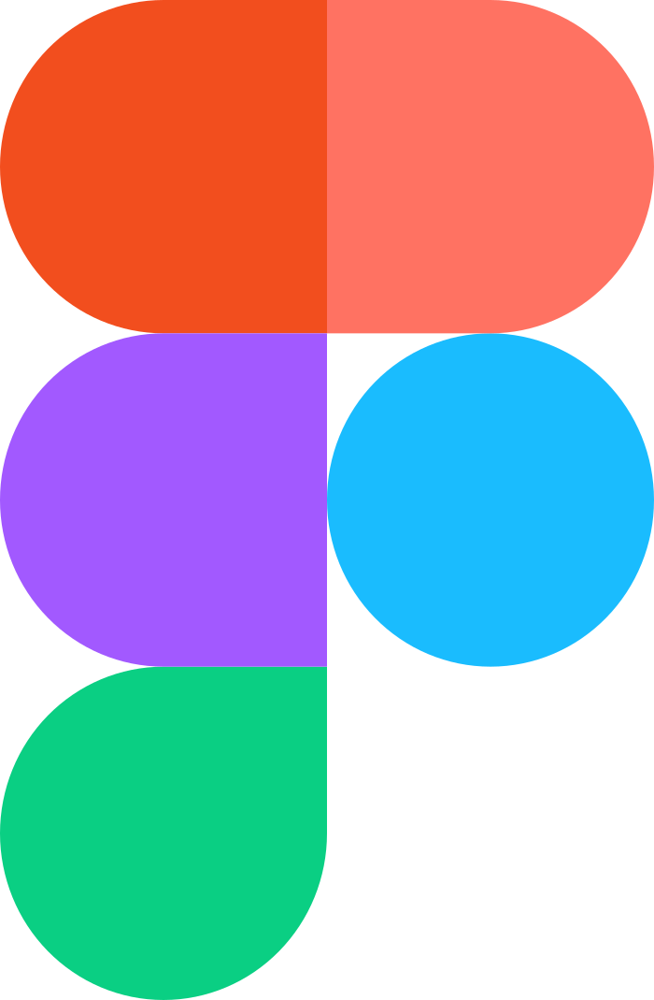

<h1 align="center">Hi 👋, I'm @cchanche</h1>
<h3 align="center">IT Engineer</h3>

 
  

I'm passionate about almost anything in tech. ✨

I graduated from engineering school in 2021, and have been working in Paris, France since.

For me, a healthy work schedule includes :

- 🔨 build great tech using my favorite tech-stack (details below 👇)
- 🙋 interact with experienced and inspiring people
- 👌 contribute to the online tech community
- 📖 learn new stuff

> Most of my work is not available publicly on github.

---

- 🔭 I’m currently working as a freelance software engineer.

- 📫 How to reach me : **clement.chanchevrier@gmail.com**

---

## My stack

| Fronted                                                |                                     |                                                                                 |
| ------------------------------------------------------ | ----------------------------------- | ------------------------------------------------------------------------------- |
|  | [**React**](https://react.dev/)     | Flexible, unopininated and great ecosystem.                                     |
|      | [**Material UI**](https://mui.com/) | Large component library with overridable default UI and handy styling utilities |

| Backend                                                 |                                               |                                                       |
| ------------------------------------------------------- | --------------------------------------------- | ----------------------------------------------------- |
|  | [**NestJs**](https://nestjs.com/)             | Robust, elegant and extensible                        |
|    | [**PostgreSQL**](https://www.postgresql.org/) | Standard SQL on steroids, integrates well with NestJs |

| Build-tools                                             |                                     |                                                                                           |
| ------------------------------------------------------- | ----------------------------------- | ----------------------------------------------------------------------------------------- |
|    | [**Vite**](https://nestjs.com/)     | Great performance, great developer-experience & extensible (for frontend apps)            |
|  | [**Rollup**](https://rollupjs.org/) | Simple, performant and great configuration options & plugins (for small native libraries) |
|     | [**SWC**](https://swc.rs/)          | Extremely fast compiler (alternative to webpack for NestJs)                               |

| CI / CD                                                     |                                                           |                                                                               |
| ----------------------------------------------------------- | --------------------------------------------------------- | ----------------------------------------------------------------------------- |
|  | [**GitHub Actions**](https://github.com/features/actions) | Ease of use and great flexibility                                             |
|        | [**Jira**](https://www.atlassian.com/fr/software/jira)    | Misses no feature and comes with a generous free-tier. Integrates with Github |
|       | [**Figma**](https://www.figma.com/)                       | Adobe is that you ? Nervermind, it's free.                                    |

| Cloud                                                       |                    |                                                             |
| ----------------------------------------------------------- | ------------------ | ----------------------------------------------------------- |
|         | **AWS ECS**        | Kubernetes, but simple                                      |
|         | **AWS CDK**        | _Infrastructure-as-typescript_ with great community support |
|          | **AWS S3**         | Cloud-storage                                               |
|         | **AWS RDS**        | Cloud-storage, but it's rows and columns                    |
|  | **AWS Cloudfront** | CDN distributions made simple                               |
